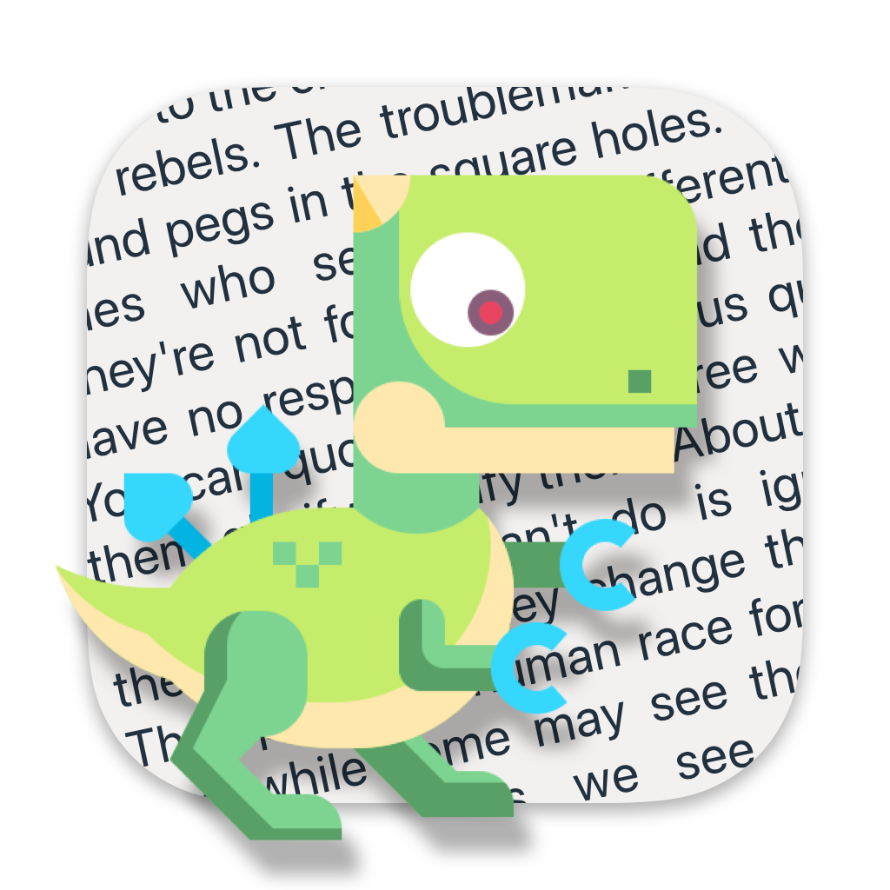
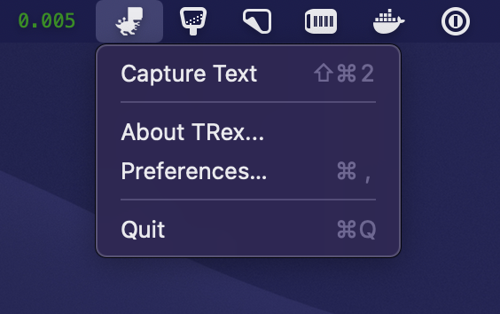

<p align="center">
 
</p>

# TRex 🦖

TRex makes OCR easy and accessible on a Mac. 

But what is OCR anyway? Imagine you have a PDF file or a Web page where you can't select the text, image with text on it, or even a YouTube video. Forget retyping it manually; with TRex, you can extract text from anywhere, and it is as easy as taking a screenshot.

TRex lives in the menu bar and available right where you need it the most:



Demo:


## Use cases
TRex can help you to copy text from:
- A PDF with non-selectable text
- A screenshot
- YouTube video
- Zoom call screen sharing
- ... and more!

If you can see it on your screen - TRex can copy it.

## How to get TRex
### GitHub
Download from [GitHub Releases](https://github.com/amebalabs/TRex/releases)

### Homebrew
or Install with Homebrew

```
brew install melonamin/formulae/trex
```
### App Store
or if you want to support us buy it from the [App Store](https://apps.apple.com/us/app/trex-easy-ocr/id1554515538)

Runs on macOS Big Sur (11.0) and up.

## ...or build it from source
- Clone or download a copy of this repository
- Open `TRex/TRex.xcodeproj`
- Press play

## Features

Every feature in TRex works offline, no internet is needed.

- Text recognition (OCR)
- Read QR Code and barcodes
- Handy macOS menu bar app, with option to hide it
- Configurable global shortcuts
- Configurable recognition language
- Automation actions
  - Open URLs found in QR codes
  - Detect and open URLs found in captured text
  - Trigger a user defined URL scheme (for integration with other apps)
- URL scheme support 
  - `trex://capture` trigger capture
  - `trex://showPreferences` open app preferences

## Acknowledgements 

Portions of this software utilize the following copyrighted material, the use of which is hereby acknowledged:
 - LaunchAtLogin - Copyright (c) Sindre Sorhus <sindresorhus@gmail.com> (sindresorhus.com)
 - KeyboardShortcuts  - Copyright (c) Sindre Sorhus <sindresorhus@gmail.com> (sindresorhus.com)

## More Apps

If you enjoy TRex you may like these as well:
* [SwiftBar](https://github.com/swiftbar/SwiftBar) - Powerful macOS menu bar customization tool
* [Esse](https://github.com/amebalabs/Esse) - Swiss army knife of text transformation for iOS and macOS
