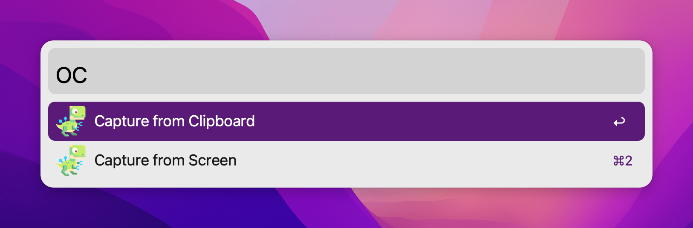

<p align="center">
 
</p>

# TRex 🦖

TRex captures any text right into your Clipboard with magic of OCR. 

But what is OCR anyway? Imagine you have a PDF file or a Web page where you can't select the text, image with text on it, or even a YouTube video. Forget retyping it manually; with TRex, you can extract text from anywhere, and it is as easy as taking a screenshot.

TRex lives in the menu bar and available right where you need it the most:


To use TRex:
1. Invoke "Capture" either through the menu bar or with a global configurable shortcut
2. Select an area of the screen you want to extract text from, just like taking a screenshot
3. There is no third step - **extracted text is in your clipboard**

Demo:


Please note, text editing application on the right is not part of TRex, this is [Tot](https://tot.rocks). 
TRex is designed to be invisible and doesn't have any UI beyond the menu bar app and preferences. 

## Use cases
TRex can help you to copy text from:
- A PDF with non-selectable text
- A screenshot
- YouTube video
- Zoom call screen sharing
- ... and more!

If you can see it on your screen - TRex can copy it.

## How to get TRex
### App Store
Buy TRex from the [App Store](https://apps.apple.com/us/app/trex-easy-ocr/id1554515538)

### GitHub
Download from [GitHub Releases](https://github.com/amebalabs/TRex/releases/latest)

### Homebrew
Install from Homebrew

```
brew install melonamin/formulae/trex
```

Runs on macOS Big Sur (11.0) and up.

## Features

Every feature in TRex works offline, no internet is needed.

- Text recognition (OCR)
- Read QR Codes and barcodes
- Handy macOS menu bar app, with option to hide it
- Configurable global shortcuts
- Configurable recognition language
- Custom words list
- CLI tool `/Applications/TRex.app/Contents/MacOS/cli/trex`
- Automation actions
  - Run a Shortcut from Shortcuts.app
  - Open URLs found in QR codes
  - Detect and open URLs found in captured text
  - Trigger a user defined URL scheme (for integration with other apps)
- URL scheme support 
  - `trex://capture` trigger capture from screen
  - `trex://captureclipboard` trigger capture from clipboard
  - `trex://captureautomation` trigger screen capture and run automation
  - `trex://captureclipboardautomation` trigger capture from clipboard and run automation
  - `trex://shortcut?name=` set Shortcut assigned to "Run Shortcut" automation action
  - `trex://showPreferences` open app preferences

## Integrations

Official Alfred workflow



## Acknowledgements 

Portions of this software utilize the following copyrighted material, the use of which is hereby acknowledged:
 - LaunchAtLogin - Copyright (c) Sindre Sorhus <sindresorhus@gmail.com> (sindresorhus.com)
 - KeyboardShortcuts  - Copyright (c) Sindre Sorhus <sindresorhus@gmail.com> (sindresorhus.com)

## More Apps

If you enjoy TRex you may like these as well:
* [SwiftBar](https://github.com/swiftbar/SwiftBar) - Powerful macOS menu bar customization tool
* [Esse](https://github.com/amebalabs/Esse) - Swiss army knife of text transformation for iOS and macOS
